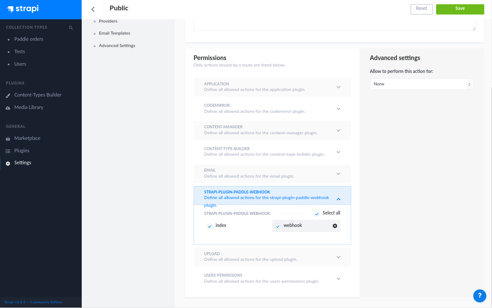

# Strapi plugin strapi-plugin-paddle-webhook

Plugin to handle [Paddle's webhook alerts](https://developer.paddle.com/webhook-reference/intro).

## How it works
--------

The plugin verifies and stores Paddle's webhook alerts and events in a customizable form.
The verification process is based on the official Paddle [documentation](https://developer.paddle.com/webhook-reference/verifying-webhooks).

After a webhook call has been verified, the plugin optionally (for more info see the customization part) stores the payload to the database and responds with HTTP 200 to Paddle.

### Data model

The plugin stores the payload in the following format:

| attribute | description           | required | comment                                         |   |
|-----------|-----------------------|----------|-------------------------------------------------|---|
| user      | Strapi user reference | false    | if there is a user with the given email address |   |
| eventTime | Paddle event_time     | true     |                                                 |   |
| email     | Paddle order email    | false    |                                                 |   |
| alertId   | Paddle alert_id       | true     |                                                 |   |
| alertName | Paddle alert_name     | true     | on fulfillment call the value will be "fulfillment" |   |
| passthrough  | Paddle passthrough | true     |                                                 |   |
| payload     | Full alert payload  | true     |                                                 |   |

## How to install
--------

### I. Install

1. Under the root folder of your project run 

NPM:
   ```
   npm install strapi-plugin-paddle-webhook --save
   ```
YARN:
   ```
   yarn add strapi-plugin-paddle-webhook
   ```

### II. Configure

The verification process uses a public key provided by Paddle, which has been loaded during the startup.
If the plugin is unable to load the key file, strapi won't start. 

Plugin Configuration:
1. Download your private key from Paddle dashboard / Developer Tools / Public key
2. Save it to a file name paddle_public.key and move to the strapi config folder
3. Create a plugins.js file (if not exists) under the config folder and set the public key's path:
    ```javascript
    module.exports = {
      'strapi-plugin-paddle-webhook': {
        publicKeyPath: './config/paddle_public.key'
      }
    }
    ```

### III. Set the API permissions 

1. Run strapi `strapi develop`
2. Enable public access for the endpoint under Settings/Roles/Public
        
3. The webhook endpoint is listening at: `http://localhost:1337/paddle-webhook/webhook` (POST)
4. After deploying strapi to your external server, you have to configure Paddle to use the webhook URL. Go to Paddle Dashboard, and under Developer Tools/Alerts / Webhooks and set the public endpoint under the `URL for receiving webhook alerts` field. 
5. The fulfillment endpoints must be set for each product separately, if you have active products you have to update them and use the same URL: `http://localhost:1337/paddle-webhook/webhook`.   

### IV. Testing

To test the endpoint in a local environment:
1. install [ngrok](https://ngrok.com/)
2. in a terminal run `ngrok http 1337`
3. Login to Paddle and go to Developer Tools/Alerts / Webhooks and select Webhook Simulator
4. Set the test URL provided by ngrok in the following format: `{ngrok public URL}/paddle-webhook/webhook`
5. Test the webhook

## Customizing the workflow 
--------
 
When an alert has been received from Paddle the plugin saves it into the database (Paddle order model) but in most cases saving the data is not enough, you have to do some additional logic (update the user, for example). 
You have two options to do this:
- create lifecycle hooks on the PaddleOrder model
- implement the plugins `afterVerified` method

#### 1. Overwriting the model lifecycles
  
You can do this by overwriting the PaddleOrder model lifecycles (see more info in the [Strapi documentation](https://strapi.io/documentation/v3.x/concepts/customization.html#plugin-extensions))
   
1. create `paddle-webhook/models` folder under the extensions folder
2. add `PaddleOrder.js`
3. crate the lifecycle hooks, for example
    ```javascript
    module.exports = {
      lifecycles: {
        async afterCreate(data) {
          console.log('paddle order created');
          console.log(JSON.stringify(data));
          // do something with the data
        }
      }
    };
    ```

#### 2. Overwriting the service afterVerified method

The plugins service has a method called `afterVerified`. 

``` javascript
  /**
   * Called after successful verification.
   *
   * @return whether a PaddleOrder item should be created
   */
  async afterVerified(_payload: any): Promise<boolean> {
    // do something with the data
    return true;
  }
```

The method has been called after every successful verification whit the payload as an argument.
The method should return a boolean, which decides whether the data should be saved to the database or not.
  